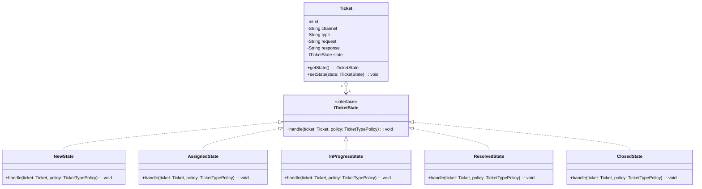

OOP-EX2

___

عرفان سادات هاشمی - ۴۰۱۲۱۷۰۰۹۰

سپهر محمدی - ۴۰۱۲۱۷۰۱۷۷

___

## بخش ۱) تشخیص زیرمسائل و الگوهای طراحی

### 1) مدیریت رفتار وابسته به وضعیت Ticket

هر وضعیت (NEW/ASSIGNED/...) رفتار متفاوتی دارد و Ticket باید انتقال وضعیت درست را طی کند

مشکل در تعداد زیاد شرط های تابع handle هست که هم کد ناخوانی هست هم در صورت نیاز به تغییر در منطق آن امکان اشتباه و نیاز به زحمت زیاد برای اضافه کردن state هست

میتوان از الگوی State استفاده کرد

 در State، به‌جای شرط‌های زیاد، رفتار به آبجکت‌های وضعیت منتقل می‌شود و اضافه کردن وضعیت جدید کم‌تغییرتر است

**کلاس‌های پیشنهادی**

اول باید اینترفیس و کلاس های state ها ساخته شوند

 `ّITicketState` (Interface)

بعد برای هر state (NEW, ASSIGNED, IN_PROGRESS, RESOLVED, CLOSED) پیاده سازی ITicketState انجام شود

---

### 2) تصمیم‌گیری بر اساس نوع Ticket

برای هر نوع Ticket (مثلاً BUG و ...) دو رفتار مهم داریم:

**Routing**: تعیین واحد مسئول (Engineering/Support/...)

**Response**: تولید یا ارسال پاسخ متناسب با نوع

**الگوی پیشنهادی**: **Strategy**

**علت انتخاب**: راهکارهای مختلف (برای انواع مختلف Ticket) قابل تعویض 
می‌شوند و با اضافه شدن نوع جدید، استراتژی جدید اضافه می‌کنیم.

**کلاس‌های پیشنهادی**

- `RoutingStrategy`
  - پیاده‌سازی‌ها: `BugRoutingStrategy`, `GenericRoutingStrategy`, ...
- `ResponseStrategy`
  - پیاده‌سازی‌ها: `BugResponseStrategy`, `GenericResponseStrategy`, ...

---

### 3) دریافت Ticket از کانال‌های ورودی مختلف (WEB/EMAIL/...)

کانال‌های ورودی متفاوت ممکن است نحوه‌ی ساخت Ticket،متفاوت داشته باشند

- **الگوی پیشنهادی**: **Factory**
- ایجاد Ticket از ورودی‌های متفاوت را از main جدا می‌کند و اضافه شدن کانال جدید را ساده‌تر می‌کند

**کلاس‌های پیشنهادی**

`TicketFactory` (Interface)

---

## بخش ۲) نمودارهای UML

### ۲-۱) نمودار کلاس برای الگوی State (مدیریت وضعیت Ticket)

### ۲-۲) نمودار کلاس برای الگوی Strategy (Routing و Response بر اساس type)

### ۲-۳) نمودار کلاس برای Factory کانال ورودی Ticket

---

## بخش ۴) تحلیل شی‌گرا (SOLID + PLK + CRP)

بعد از اعمال تغییرات

از نظر OCP واضح است که اضافه کردن فیچر ها مثل افزودن انواع مختلف channel بخش های مربوط به بررسی تیکت و همینطور اضافه کردن state ها با استفاده از این الگو های طراحی نیاز به تغییرات کمتر دارد اما در مدل قبلی برای اضافه کردن هر کدام نیاز به تغییر در بخش های مختلفی بود

از نظر DIP هم به طور کلی کد اینترفیسی نداشت اما بعد از تغییرات با توجه به استفاده از الگو های طراحی از اینترفیس بیشتر برای رابطه بین کلاس ها استفاده شده مثل ITicketState برای کلاس های state

از نظر CRP هم تیکت وضعیت خودش رو به عنوان یک object از ITicketState نگه میدارد

